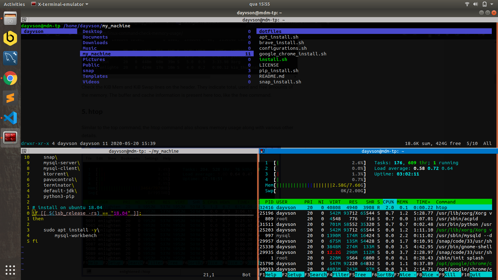

# My machine - Repository

## Intro this repository

This repository serves to store the files that I use to install and configure my personal computer. It contains the installation and configuration files and is always changed, as I install various software to test, as well as uninstall. My biggest motivation to create it was to enjoy experimenting a lot with Debian distributions, as I didn't want to install all my programs manually, I decided to create a script for that.

## To install

To install all the software in these files, you can run:

> sudo ./install.sh

but you can comment the line if you don't want to install any of the programs. With this command the configuration files will also be copied.

# Demo

My terminal opem with softwares

My softwares installed

